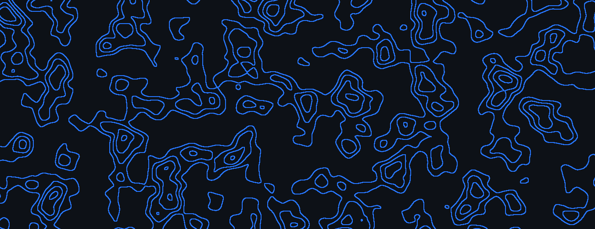

# Fractal noise animation generator

An overengineered modular animation generator based on fractal noise.

This was originally a project to replace my existing background, however ended up becoming an entire
modular system for creating these specific types of animations.


### Usage

This project is managed using [uv](https://docs.astral.sh/uv/), consider using it to install the 
project's dependencies.

Run the main module:
```shell
python3 -m noiseAnimationGenerator
```

The pipeline can be configured by editing `__main__.py` located in `noiseAnimationGenerator/`.

### Notes

The 3D fractal noise generator itself isn't particularly memory efficient, 
and generating large amounts of frames will result in _very high_ memory consumption.
Using the 2D generator (`NoiseSource` instead of `NoiseSource3D`) mostly eliminates this problem.

It is recommended to post-process videos you plan on using afterward, as per default a border is emitted
around each frame, as well as a very high bitrate (resulting in sometimes undesirably large files). 
Such post-processing can be done with ffmpeg, for example:
```shell
# crop with 30 MBit/s bitrate
ffmpeg -i output-pipeline.mp4 -vcodec libx264 -b:v 30M -vf "crop=1080:2400:10:10" output_cropped.mp4

# crop with default bitrate (6-10 MBit/s)
ffmpeg -i output-pipeline.mp4 -vcodec libx264 -vf "crop=1080:2400:10:10" output_cropped.mp4
```

### Examples

See `__main__.py` for an example detailing the most common use-cases.

The following code was used to generate the `GIF` displayed at the top of this readme:

```python
(Pipeline(verbose=True)
    .source(NoiseSource3D(
        8,
        (544, 1376),
        (8, 16),
        True,
        2
    ))
    .addSteps([
        NormalizeValues(),
        Interpolate(40),
        ToPIL(),
        Posterize(3),
        Brighten(2),
        FindEdges(),
        Brighten(4),
        Colorize([39, 119, 255], [13, 17, 23]),
        Quantize(),  # Use Quantizer to reduce to only 2 colors - for smaller GIF
        ToCV2(),
        Dilate(2, 1),
        CollectVideo("./out/output-pipeline.avi", "RGBA")  # Save as raw frames to avoid artefacts
    ])
    .execute()
)
```

The resulting AVI was post-processed using the following ffmpeg command:

```shell
ffmpeg -i out/output-pipeline.avi -filter_complex "crop=1356:524:10:10,fps=16,split[s0][s1];[s0]palettegen=max_colors=4:reserve_transparent=0[p];[s1][p]paletteuse" out/demo.gif
```

The crop removes a 10-pixel border around the entire video, removing the colored border.
